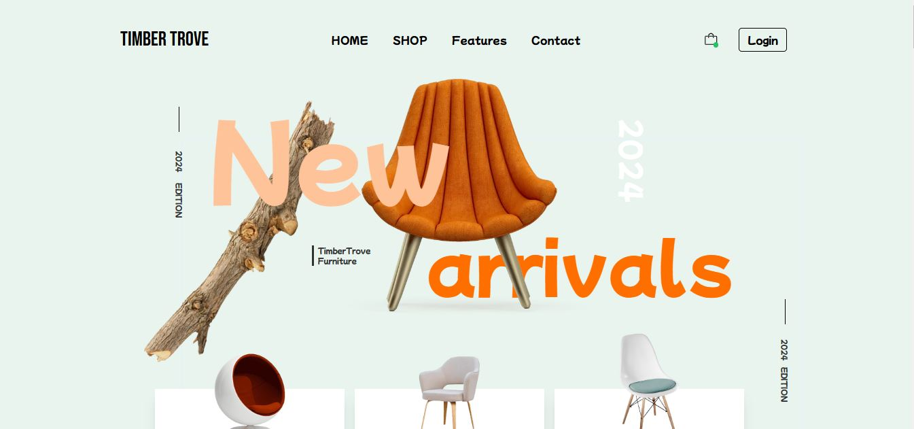

# Furniture Website


A modern and responsive React application for a furniture website, designed with Tailwind CSS for seamless styling and layout.

## Features

This application is composed of various sections to create a complete furniture website:

1. **Header**: Navigation bar and branding for the website.
2. **LoungeChar**: Showcases lounge chair collections.
3. **NewArrival**: Highlights the latest arrivals in furniture.
4. **BestDeals**: Displays the best deals available with a countdown timer.
5. **HandPick**: Features handpicked furniture items for customers.
6. **Subscribe**: Encourages users to subscribe for updates and offers.
7. **ShopLook**: Highlights the trending styles and looks for inspiration.
8. **OurBlog**: Contains articles and blogs related to furniture and interior design.
9. **FeedbackCorner**: A section for customer feedback and testimonials.
10. **TopBrand**: Showcases top furniture brands associated with the website.
11. **Footer**: Provides additional links, contact information, and legal disclaimers.

## Technologies Used

- **React**: For building reusable and dynamic components.
- **Tailwind CSS**: For fast and efficient styling.

## Installation

1. Clone the repository:

   ```bash
   git clone https://github.com/rakiburrahman307/furniture-landing-page
   ```

2. Navigate to the project directory:

   ```bash
   cd furniture-website
   ```

3. Install dependencies:

   ```bash
   npm install
   ```

4. Start the development server:

   ```bash
   npm start
   ```

## File Structure

```
.
├── src
│   ├── assets          # Images and other assets
│   ├── components      # All React components
│   │   ├── Header
│   │   ├── LoungeChar
│   │   ├── NewArrival
│   │   ├── BestDeals
│   │   ├── HandPick
│   │   ├── Subscribe
│   │   ├── ShopLook
│   │   ├── OurBlog
│   │   ├── FeedbackCorner
│   │   ├── TopBrand
│   │   └── Footer
│   └── App.js          # Main application file
└── tailwind.config.js  # Tailwind CSS configuration
```

## How to Use

- Explore the sections using the navigation bar.
- Browse through the latest arrivals, best deals, and handpicked items.
- Subscribe to stay updated on the latest offers and trends.
- Read blogs for insights on furniture and interior design.
- Check customer feedback and explore top furniture brands.

## License

This project is open-source and available under the [MIT License](LICENSE).

---

Feel free to contribute to enhance the functionality and design!
